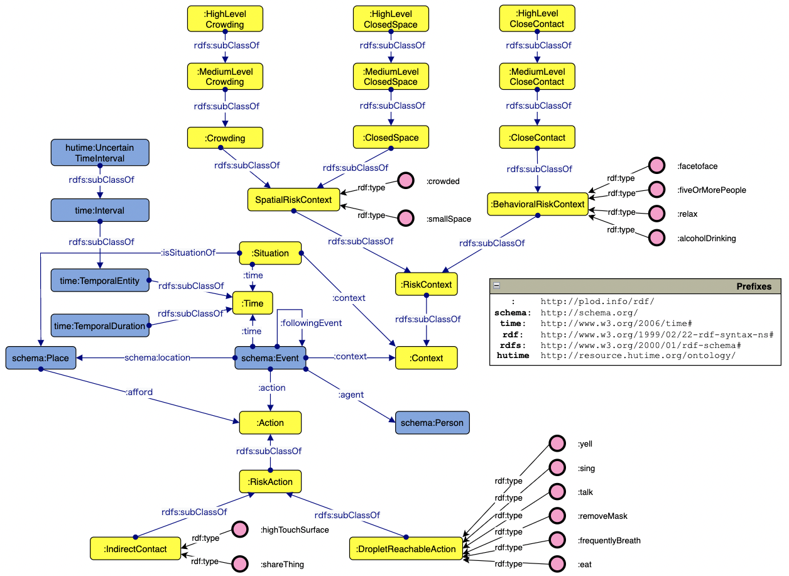
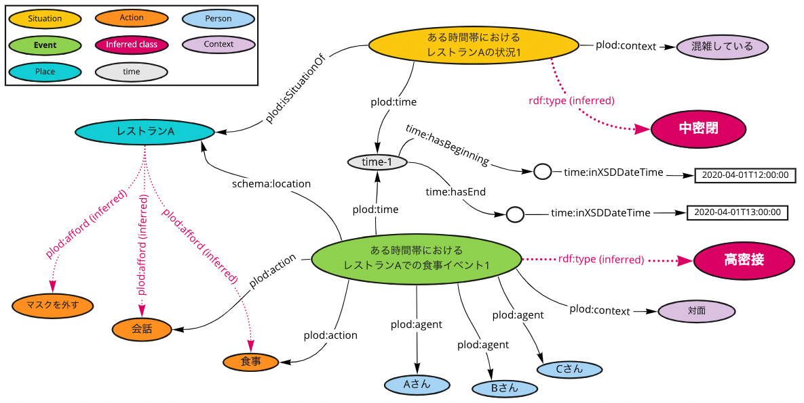

# Patient Locational Ontology-based Data (PLOD)

## 目次
- [概要](#概要)
- [提案データセット](#提案データセット)
- [COVID-19感染リスク推論オントロジー（CIRO）](#covid-19感染リスク推論オントロジーciro)
- [オントロジーに基づく個々のデータ（PLOD）](./rdf/example/)
- [PLODの使用例](./sparql/)

## 概要
- COVID-19の感染拡大防止に向けて，日本国政府では「[3つの密](https://www.kantei.go.jp/jp/content/000061868.pdf)」（以下，三密）や，「[5つの場面](https://corona.go.jp/prevention/pdf/infection-20201117.pdf)」を提言しています．
- これらの提言に基づき，各人の感染リスクを自動で評価できれば，追跡調査対象者の順序付けやスクリーニングといった保健所で行われている業務を大幅に効率化できると考えています．
- そこで，場所や行動に紐づくCOVID-19感染リスクを整理し，個別の行動事例における感染リスクを推論可能なオントロジー(CIRO)を開発しました．
- 本リポジトリでは，このオントロジーに基づいてナレッジグラフ化(RDF化)された疑似データ（PLOD）を，オープンデータとして提供します．
- このようなデータを使用することで，追跡調査に有用な三密リスクの推論とグラフ検索が可能なことを示しています．

## 提案データセット
- [COVID-19感染リスク推論オントロジー（CIRO）](./rdf/CIRO.owl)
- [オントロジーに基づく個々のデータ（PLOD）](./rdf/example/ciro_sample.rdf)

## COVID-19感染リスク推論オントロジー（CIRO）

### オントロジーの仕様書
全クラス・インスタンス・プロパティの説明は下記の仕様書を御覧ください。  
[https://plod-info.github.io/PLOD/ciro.html](https://plod-info.github.io/PLOD/ciro.html)  
以下で代表的なクラス・プロパティを説明します。

### スキーマ図
黄色が新規に作成したクラス。青色が再利用したクラス。

## オントロジーに基づく個々のデータ（PLOD）

現在，構築したオントロジーを保健所のシステムに応用することを想定しています．そこで，システムへの導入を前に，行動調査を模した擬似的な行動シナリオの模擬データを作成し，オントロジーに基づいてナレッジグラフ化しました．例えば，下図のような行動イベントがナレッジグラフ化されています．赤矢印はCIROのOWL推論により導出されるリンクです．

## PLODの使用例
